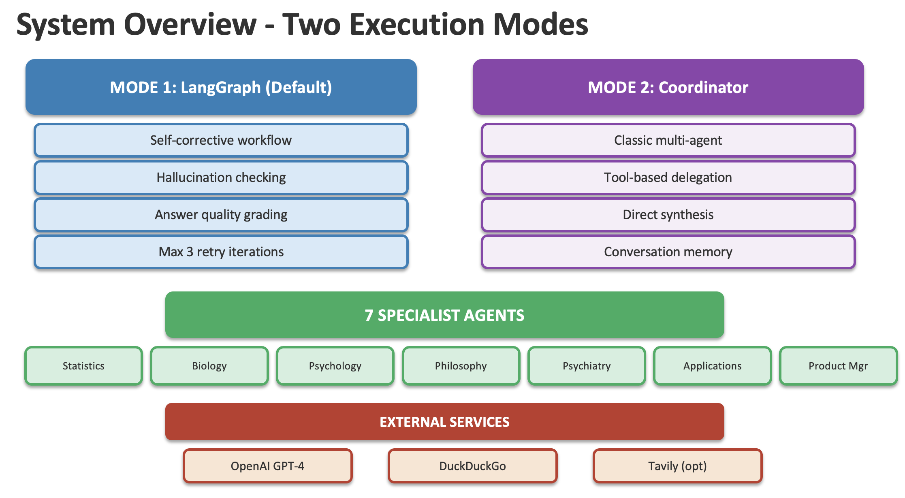
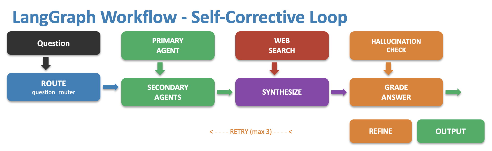
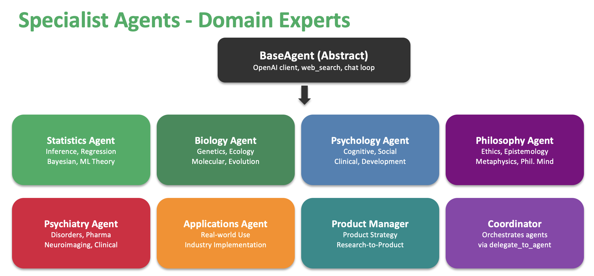

# Multi-Agent Research Assistant

A coordinated multi-agent system for literature review across multiple academic domains, with research-to-product pipeline capabilities.

## Features

- **8 Specialist Agents** covering academic research, product development, and documentation
- **Two Execution Modes**: LangGraph (self-corrective) and Coordinator (classic orchestration)
- **Hallucination Checking** and self-correction loop (LangGraph mode)
- **Cross-Domain Synthesis** for interdisciplinary queries
- **Research-to-Product Pipeline** for translating research into applications
- **Web Search Integration** via DuckDuckGo (no extra API key needed)

## Architectures of the Agents:






## Available Agents

### Research Domain Agents

| Agent | Key | Focus Areas |
|-------|-----|-------------|
| **Statistics Agent** | `statistics` | Statistical inference, regression, high-dimensional methods, causal inference, ML theory, computational statistics |
| **Biology Agent** | `biology` | Molecular biology, genetics, genomics, ecology, evolutionary biology, bioinformatics |
| **Psychology Agent** | `psychology` | Cognitive, social, developmental, clinical, neuropsychology, I/O psychology |
| **Philosophy Agent** | `philosophy` | Ethics, epistemology, metaphysics, philosophy of mind/science, logic |
| **Psychiatry Agent** | `psychiatry` | Mental disorders, psychopharmacology, neuroimaging, clinical treatments |

### Applied Agents

| Agent | Key | Focus Areas |
|-------|-----|-------------|
| **Applications Agent** | `applications` | Real-world use cases, industry implementations, case studies, production deployment |
| **Product Manager Agent** | `product_manager` | Product strategy, user requirements, MVP definition, research-to-product translation |
| **Writing Agent** | `writing` | PRDs, research papers, technical reports, white papers, documentation, academic manuscripts |

## Execution Modes

### LangGraph Mode (Default)

Self-corrective workflow with intelligent routing and quality assurance:

```bash
python main.py                    # Default mode
python main.py --mode langgraph   # Explicit
```

**Features:**
- Smart routing to appropriate domain expert(s)
- Cross-domain synthesis for interdisciplinary queries
- Hallucination checking (verifies claims are grounded)
- Self-correction loop (refines answers up to 3 iterations)
- Web search fallback for additional sources

**Workflow:**
```
Question → Route → Query Agent(s) → [Web Search] → Synthesize → Check Hallucination → Grade Answer → [Retry] → Final Response
```

### Coordinator Mode

Classic multi-agent orchestration with manual coordination:

```bash
python main.py --mode coordinator
```

**Features:**
- Direct delegation to specialist agents
- Coordinator synthesizes multi-agent responses
- Interactive conversation with memory
- Manual control over agent selection

## Project Structure

```
stats_agent/
├── main.py                          # Main entry point (mode selection)
├── langgraph_agent.py               # LangGraph workflow implementation
├── state.py                         # Research state definition
├── nodes.py                         # Workflow nodes (routing, synthesis, grading)
├── graders.py                       # Hallucination and answer grading
├── tools.py                         # Shared tools (web search)
│
├── agents/
│   ├── __init__.py
│   ├── base_agent.py                # Shared agent functionality
│   ├── coordinator.py               # Orchestrates all agents
|
│   ├── statistics_agent.py          # Statistical methods expert
│   ├── biology_agent.py             # Life sciences expert
│   ├── psychology_agent.py          # Behavioral science expert
│   ├── philosophy_agent.py          # Philosophical research expert
│   ├── psychiatry_agent.py          # Mental health expert
│   ├── applications_agent.py        # Industry applications expert
│   ├── product_manager_agent.py     # Product strategy expert
│   └── writing_agent.py             # Documentation and writing expert
│
├── docs/                            # Generated documents
│   ├── PRD_Optimized_Checkout.md
│   ├── PRD_Optimized_Checkout.tex
│   ├── AB_Testing_Methodology.tex
│   └── Psychology_Ecommerce_Pipeline2.pptx
│
├── slides_templates/                # Presentation templates
│   ├── README.md
│   ├── google_slides_templates.md
│   ├── slidesgo_templates.md
│   └── slidescarnival_templates.md
│
├── run_pipeline.py                  # Research-to-product pipeline runner
├── generate_prd.py                  # PRD document generator
├── generate_ab_testing.py           # A/B testing methodology generator
├── examples.py                      # Usage examples
│
├── stats_literature_agent.py        
|
│   ├── statistics_agent.py
│   ├── biology_agent.py
│   ├── psychology_agent.py
│   ├── philosophy_agent.py
│   ├── psychiatry_agent.py
│   └── trip_agent.py
|
├── stats_literature_agent_openai.py # Standalone GPT-4 version
└── requirements_openai.txt          # OpenAI dependencies
```

## Setup

1. **Install dependencies:**
   ```bash
   pip install -r requirements_openai.txt
   ```

2. **Set your OpenAI API key:**
   ```bash
   export OPENAI_API_KEY=your-api-key
   ```
   Get a key at: https://platform.openai.com/api-keys

3. **Run the system:**
   ```bash
   python main.py                    # LangGraph mode (default)
   python main.py --mode coordinator # Coordinator mode
   ```

## Usage Examples

### Single-Domain Queries
```
"What is propensity score matching?"
"Find recent papers on Bayesian optimization"
"Review literature on SSRI efficacy in depression"
```

### Cross-Domain Queries
```
"How are statistical methods used in psychology research?"
"What's the philosophy of mind perspective on psychiatric disorders?"
"Review the neuroscience vs philosophy debate on free will"
```

### Research-to-Product Queries
```
"How is causal inference used in psychiatric trials?"
"What are industry applications of A/B testing?"
"How can I productize a recommendation system based on collaborative filtering?"
```

### Full Pipeline Queries
```
"Find psychology research on e-commerce behavior and create a product strategy"
"Review statistical methods for personalization and suggest product features"
```

### Documentation & Writing Queries
```
"Write a PRD for a recommendation system based on collaborative filtering"
"Create a research paper outline on causal inference in A/B testing"
"Draft a technical report on machine learning model deployment best practices"
"Write a white paper on the application of Bayesian methods in clinical trials"
```

## Commands (Interactive Mode)

| Command | Description |
|---------|-------------|
| `agents` | List all available specialist agents (Coordinator mode) |
| `clear` | Clear conversation history for all agents |
| `quit` | Exit the program |

## Agent Collaboration Patterns

### Theory + Practice
Combine domain experts with Applications Agent:
- Statistics + Applications → "How is LASSO used in production ML systems?"

### Research to Product
Full pipeline with Product Manager:
- Psychology + Applications + Product Manager → "Translate behavioral research into e-commerce features"

### Cross-Domain Synthesis
Multiple domain experts:
- Statistics + Psychology → "Meta-analysis methods in psychology"
- Philosophy + Psychiatry → "Consciousness theories in psychiatric practice"

### Documentation Workflows
Domain expert + Writing Agent:
- Statistics + Writing → "Write a technical report on propensity score methods"
- Psychology + Product Manager + Writing → "Create a PRD for a behavioral intervention app"

## Pipeline Tools

### Generate PRD
```bash
python generate_prd.py
```
Generates Product Requirement Documents from research insights.

### Generate A/B Testing Methodology
```bash
python generate_ab_testing.py
```
Creates statistical testing frameworks for product experiments.

### Run Full Pipeline
```bash
python run_pipeline.py
```
Executes the complete research-to-product workflow.


### GPT-4 Version
```bash
pip install -r requirements_openai.txt
export OPENAI_API_KEY=your-key
python stats_literature_agent_openai.py
```

## License

MIT
